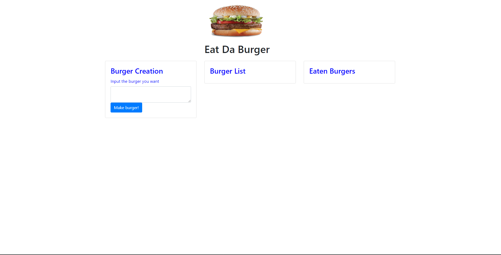

# Eat-Da-Burger

## URL Link

https://radiant-caverns-44745.herokuapp.com/

## Description

This application exists to build a simple table to manipulate the vaules of said table with a press of a button. The user is able to create the names of the burgers as they see fit. 

## Example

## Usage

* The left most card intakes the names of burgers and stores them in the database.
* The middle card displays the names of the stored burgers, and generates a button next to each one. In the database, these burgers are set to "False" when it comes to have been eaten.
* Clicking the "It's Devour Hour" button sets the burger to "True" when eaten, and sends all eaten burgers to the third card, that represents all eaten burgers. 

## Technologies Used

* Node JS
* Javascript
* Heroku
* Bootstrap
* Handlebars
* MySQL
